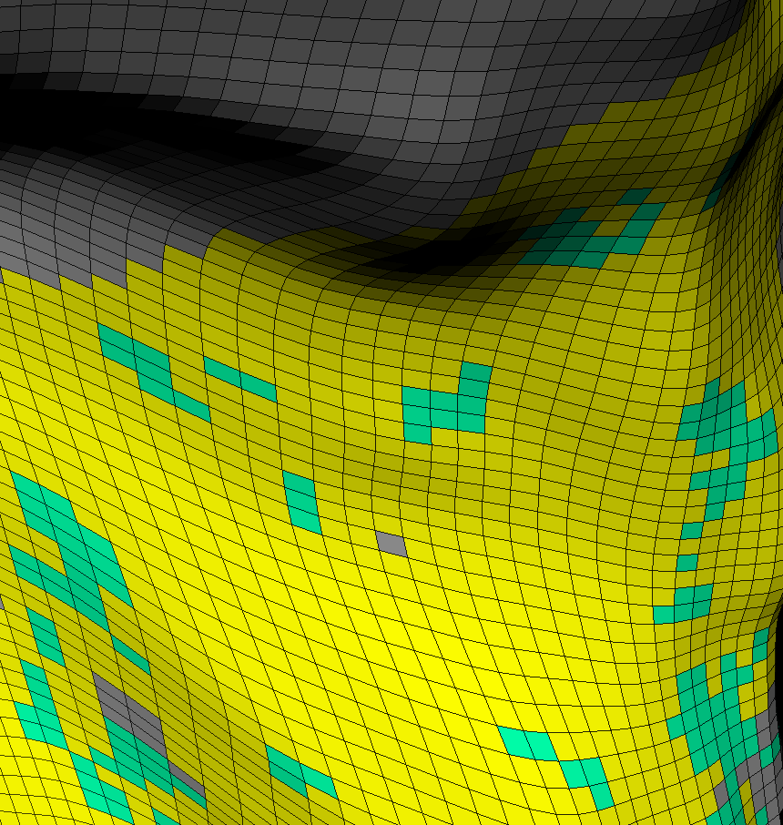
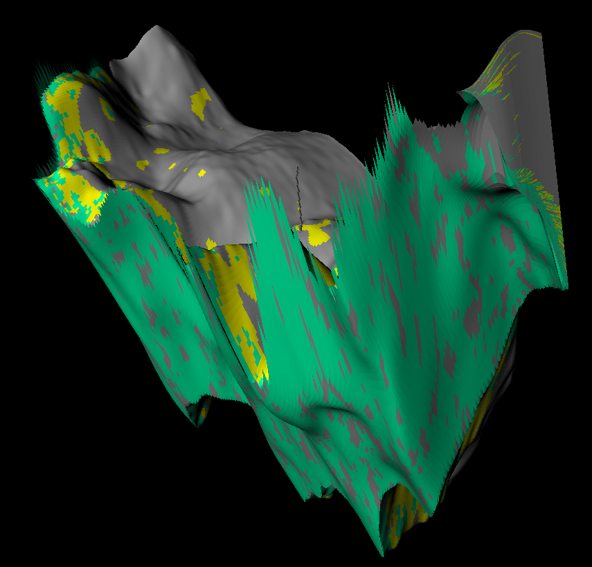

# 储层模型与 SAM3 分割需求说明

## 一、项目核心目标

前期目标是统一管理和显示地震体、层位、断层、井、岩性体等对象。后续重点将逐渐转向 **储层模型**，尤其是从 Petrel 导出的岩性模型和孔隙度模型。

后期希望在储层模型上使用 SAM3 做智能分割，例如：

- 分割特定岩性体
- 分割高孔隙度区域
- 分割砂体、砾岩体、泥岩隔夹层
- 在剖面上圈定目标区域后，能够转化为三维储层模型中的真实网格单元
- 最终服务于储层评价、圈闭分析、有效储层识别等工作

核心目标不是在二维图片上得到一个 mask，而是让 AI 分割结果真正回写到地质模型中。

## 二、当前发现的关键问题

Petrel 导出的储层模型与普通地震体不是同一类数据。地震体通常是规则三维数组：

```text
seismic[inline, xline, sample] = 振幅值
```

这种数据天然可以按 Inline、Xline、Z 三个方向切片显示。

而 Petrel 储层模型是 corner-point grid。它不是规则像素体，而是由一个个地质网格单元组成。每个 cell 具有真实空间几何、顶底面、厚度、倾角、断层错断和有效性。

相关文件包括：

```text
１２３４.GRDECL          属性值：LITHOLOGIES / PORO
１２３４_COORD.GRDECL    网格柱坐标
１２３４_ZCORN.GRDECL    每个 cell 的角点深度
１２３４_ACTNUM.GRDECL   有效单元标记
```

因此，如果简单把该模型转换成类似地震体的规则三维数组来渲染，会损失大量 Petrel 模型中的细节信息，包括：

- 原始储层网格线
- cell 的真实形状
- 断层错断关系
- 层间尖灭
- 非均匀厚度
- 倾斜单元
- ACTNUM 控制的不规则有效范围
- I/J/K 网格拓扑关系
- Petrel 模型本身的地质结构

当前已有的：

```text
lithology_volume_seismic.npy
porosity_volume_seismic.npy
```

是把 Petrel 模型重采样到地震规则网格后的结果。它适合与地震体叠加、快速切片和粗略显示，但不适合作为精细储层模型的唯一表达。

## 三、后续储层模型表达方式

后续软件中应按照 Petrel 的原始储层网格版本来表达储层模型，用于精细解释、Petrel 风格显示、cell 级分割、储量统计和属性统计。

应直接基于：

```text
COORD + ZCORN + ACTNUM + LITHOLOGIES + PORO
```

软件内部需要建立真正的储层网格对象，且后续精细解释和 AI 结果回写应建立在该 `ReservoirGrid` 上，而不是只建立在规则体 mask 上。

一个合理的内部数据对象可以是：

```text
ReservoirGrid
  - nx, ny, nz
  - cell geometry
  - active mask
  - lithology per cell
  - porosity per cell
  - cell adjacency
  - cell_id
```

## 四、SAM3 在储层模型上的合理使用方式

SAM3 本身处理的是图像，不直接理解 Petrel 网格。因此正确路线不是简单地：

```text
储层模型 -> 转成普通图片 -> SAM3 分割 -> 得到图片 mask
```

更合理的路线应是：**把 SAM3 作为二维智能圈选工具，把最终结果回写到储层模型 cell 上**。

推荐流程如下：

```text
Petrel 原始储层模型
  -> 构建 ReservoirGrid
  -> 渲染 I/J/K 剖面、任意剖面或层面图
  -> 同步生成 cell_id 映射图
  -> SAM3 对渲染图进行分割
  -> 将像素 mask 通过 cell_id 映射回真实网格单元
  -> 得到 selected_cells
  -> 基于储层网格拓扑做三维传播、约束和统计
  -> 生成 ReservoirSelectionLayer / ReservoirBodyLayer
```

关键点是渲染时不能只生成一张给人看的彩色图，还必须同步生成一张内部使用的 `cell_id buffer`：

```text
显示图：pixel[x, y] = 岩性颜色 / 孔隙度色带 / 地震叠合颜色
ID 图：pixel[x, y] = cell_id
```

这样 SAM3 输出 mask 后，可以从被选中的像素反查到真实储层模型中的 cell：

```text
SAM3 mask pixels -> cell_id 集合 -> selected_cells[i, j, k]
```

最终保存的结果不应只是二维 mask，而应是储层模型上的 cell 级结果，例如：

```text
ReservoirBodyLayer
  - cell_ids
  - source = SAM3
  - lithology constraints
  - porosity statistics
  - connected components
  - volume
```

三维扩展不应完全依赖 SAM3。SAM3 更适合作为二维剖面上的智能交互工具，后续三维传播应结合储层模型本身的拓扑和地质约束。

## 五、当前主要技术困难

第一，数据结构复杂。

地震体是规则数组，而储层模型是 corner-point grid。必须解析 COORD、ZCORN、ACTNUM，重建每个 cell 的真实几何关系。

第二，渲染方式复杂。

地震剖面渲染通常只是取一张二维矩阵。储层模型剖面渲染需要切过真实网格单元，显示 cell 面、网格线、属性颜色和断层错断关系。若要接近 Petrel 效果，需要专门的储层网格渲染器。

第三，SAM3 结果映射复杂。

SAM3 输出的是像素 mask，但最终对象是储层 cell。必须建立从像素到 cell 的映射关系，否则 AI 结果无法真正回写到储层模型。

```text
像素 -> cell_id -> 储层模型单元
```

第四，三维传播复杂。

SAM3 擅长 2D 分割，但储层模型是 3D。不能简单把单剖面的 mask 复制到三维。后续需要结合：

- cell 邻接关系
- 岩性类别
- 孔隙度阈值
- ACTNUM
- 层位约束
- 断层边界
- 连通性分析
- 多剖面交互确认

第五，软件架构需要扩展。

当前软件已有 `VolumeLayer`、`LithBodyLayer` 等概念，但储层模型不应简单塞进 `VolumeLayer`。后续应增加独立的储层模型层类型，例如：

```text
ReservoirGridLayer
ReservoirPropertyLayer
ReservoirSelectionLayer
ReservoirBodyLayer
```

这样后续 SAM3 分割、属性统计、连通体分析和结果导出才有可靠基础。
